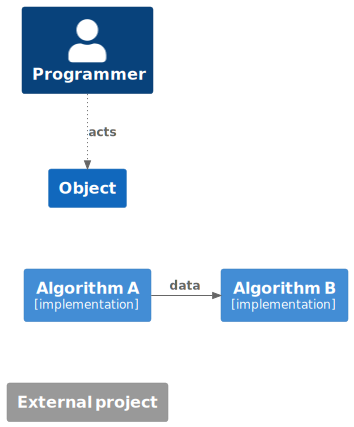

# Architecture

The Catalyst stack leverages existing state-of-the-art technologies and combines them into a neat
package to accelerate quantum workflows without losing the ability to quickly prototype in Python.
Some of the projects Catalyst depends on include the [MLIR](https://mlir.llvm.org/docs/) and
[LLVM](https://llvm.org/) compiler frameworks, the [QIR](https://github.com/qir-alliance) project,
as well as the [JAX](https://jax.readthedocs.io/en/latest/) framework for composable transforms in
Machine Learning (ML).
Among the transforms provided by JAX, the two most important ones arguably consist of automatic
differentition (AD) and just-in-time (JIT) compilation.
AD has long been one of the cornerstones of the PennyLane project, and, with the introduction of
Catalyst, JIT compilation for quantum (and hybrid quantum) programs is added as another focus.

While PennyLane is used as the primary frontend to Catalyst, each element of the compilation stack
is in-principle built in a modular and reusable way. Let's take a look at what this stack looks
like.

## Compilation Stack

The following diagram represents the current architecture of Catalyst using an adaptation of the C4
container model. The [Legend](#legend) section describes the notation in more details.

The three components of the stack can be summarized as follows:

- **Frontend:** A Python frontend for just-in-time compilation & execution of PennyLane programs.
    Currently traces hybrid computation by leveraging the JAX infrastructure and extending the JAX
    Program Representation, but this will be generalized in the future.

- **Compiler Core:** An MLIR-based compiler for hybrid quantum programs.
    Provides optimizations and other transformations such as automatic differentiation, with a
    growing library of compilation passes.
    Targets LLVMIR with QIR syntax for code generation.

- **Runtime:** A runtime library for execution of hybrid quantum programs.
    While classical computation is compiled to native code, all quantum functionality is managed and
    provided by the runtime as an interface layer to backend devices (such as CPU simulators,
    GPU simulators, and hardware).

## Frontend

An overview of the Python frontend is presented below. At the moment, the frontend is not only
resposible for converting user programs to the compiler IR, but also comes with a compiler driver
that manages the entire compilation pipeline.

Generally speaking, compilation happens in 3 stages which are successively invoked by the frontend
and compiler driver:

- **Program Capture / IR Generation:** The frontend primarily provides a method for hybrid program
    capture of PennyLane/JAX programs. This is achieved by leveraging the tracing & op queueing
    mechanism of both frameworks, extending the JAX program representation (JAXPR) with quantum
    primitives. Custom JAXPR -> MLIR lowerings are registered to these primitives to fully convert
    a hybrid program to MLIR for consumption by the compiler.

- **Program Transformation:** The main phase of the compilation process is performed on the
    MLIR-based representation for hybrid quantum programs defined by Catalyst.
    The user program is passed to the Catalyst compiler libraries in its textual form, as the MLIR
    memory objects are not compatible between Catalyst and `jaxlib`.
    The driver then invokes a sequence of transformations that lowers the user program to a lower
    level of abstraction, outputing LLVMIR with QIR syntax.
    For more details consult the [next section](#compiler-core).

- **Code Generation:** At this stage the LLVMIR is compiled down to native object code using the
    LLVM Static Compiler (`llc`) for the local system architecture. A native linker is then used
    to link the user program to the Catalyst Runtime library.
    The frontend will load this library into the Python environment and attach its entry point to
    the callable `@qjit` object defined by the user.
    For more details on the program execution consult the [runtime section](#runtime--execution).

Elaborating on the program capture phase, tracing is a mechanism by which a function is executed
with abstract arguments called *tracers*. Calling operations from the tracing library (such as
`jax.numpy`) will record the operation and which tracers (or constants) it acts upon in a global
data structure. Note that JAX's tracing contexts are thread-local and can be nested to allow scoped
region capture, which is relevant when tracing control flow operations.

During the tracing of quantum functions (`qml.qnode`), PennyLane's queuing context is activated to
build a `QuantumTape` data structure that records all quantum operations. Here as well nested
queuing contexts are leveraged to allow for scoped operation capture, including control flow
operations which are themselves captured as pseudo-quantum operations on the tape.

Catalyst provides the "glue" to embed quantum tapes into the JAXPR, by converting PennyLane
operations to their corresponding JAX primitive and by connecting operation arguments/results to the correct tracer objects.

## Compiler Core

This section will focus on the series of compiler passes that convert a high-level quantum program
to its low-level LLVM IR and subsequent binary form. While the exact passes may frequently change,
the general stages should still be applicable.
See the graph below for an overview of the transformations applied to the user program:

- **HLO lowering:**

  - HLO is a high-level IR used by the XLA compiler to compile tensor compute graphs, like those
    produced by JAX and TensorFlow. JAX natively outputs HLO in MLIR form, via the `StableHLO` MLIR
    dialect.

  - Since we provide our own compilation & code generation pipeline, we lower out of the HLO dialect
    into standard MLIR dialects, such as `linalg`, `arith`, `func`, and others. This is done using
    the lowerings provided by the [mlir-hlo](https://github.com/tensorflow/mlir-hlo) project over
    in the TensorFlow repository.

  - Quantum dialect operations present in the input are not affected by this transformation.

- **Quantum optimizations:**

  - Many quantum compilation routines can be run at this point, in order to reduce the gate or qubit
    count of the program. This could include peephole optimzations expressed as MLIR DAG rewrites
    (such as adjoint cancellation, operator fusion, gate identities, etc.), or more complex
    synthesis algorithms that act on an entire block of quantum code.

- **Automatic differentiation:**

  - Several automatic differenation routines are implemented at the compiler level. In general,
    a quantum function will be split out into *classical pre-processing* and *quantum execution*.
    Separate compilation routines are then applied to both components.

  - For the classical pre-processing, the main method of differentiation is forward or reverse mode
    AD via the [Enzyme](https://github.com/EnzymeAD/Enzyme) framework. Enzyme can also drive the
    differentiation of the entire program to allow differentiating through post-processing functions
    as well. In this case, quantum AD methods are registered as custom gradients in the framework.

  - For the quantum execution, different methods are available depending on the execution method.
    On simulators with support for it, the most efficient differentiation method is the
    *adjoint-jacobian* method, a technique similar to classical backpropagation. By taking
    advantage of the reversibility of quantum computing, a backwards pass can be performed with a
    much lower memory footprint than with backpropagation. Hardware compatible methods can directly
    be applied in the compiler without requiring explicit device support. This includes the
    *parameter-shift* method and *finite-differences*. The parameter-shift method has been adapted
    to work in presence of hybrid program representations including control flow, as long as
    measurement feedback is not used.

  - Checkpointing is employed to eliminate redundant computations of the pre-processing, by storing
    interemediate results and control flow information in a forwards pass through the classical code
    to allow the quantum program to be reconstructed exactly.

- **Classical optimizations:**

  - Basic optimizations are frequently performed in between other passes in order to improve
    performance and reduce the computational load of subsequent transformations. This includes
    dead code elimation, common sub-expression elimination, and constant propagation, as well
    other simplifactions (cannonicalizations) registered to the various dialect operations.

  - More advanced optimzation techniques might also be added to various parts of the pass pipeline.

- **Bufferization:**

  - Bufferization is a process by which operations are transformed from operating on *tensors* to
    operating on memory, represented by *memrefs* (Memory References) in MLIR. The key difference
    between the two is that tensors behave according to value semantics, that is they cannot be
    modified in-place. Instead, operations consume and produce new tensor values.

  - In order to bufferize a program, memory has to be allocated and a buffer assigned to each
    tensor, reusing buffers whenever possible to minimize unnecessary data copies, and eventually
    deallocating buffers when they are no longer needed to prevent memory leaks.

  - Bufferization should generally be the last step before converting to the LLVM dialect, as
    optimizations are typically easier to implement in the tensor domain than in the memory domain.

- **LLVM dialect generation:**

  - As an intermediate step in the LLVM IR generation, the LLVM dialect in MLIR provides a simple
    target for other dialects to lower to, and simplifies the conversion between MLIR and LLVM IR
    by providing a one-to-one mapping from MLIR objects to LLVM IR objects.

  - Generally, dialects will make use of the dialect conversion infrastructure to provide lowerings
    to the LLVM dialect. The quantum dialect provides lowering patterns to QIR-style operations, and
    the Catalyst gradient dialect can lower to device-based implementations of quantum AD or to an
    Enzyme-based implementation for AD on classical code.

- **LLVM IR generation:**

  - Conversion from the LLVM dialect in MLIR to LLVM IR is handled by the `mlir-translate` tool.

- **Enzyme auto-differentiation:**

  - Functions that have been set-up to be differentiated via Enzyme will be transformed at this
    stage. The seperately compiled Enzyme library is loaded into the LLVM `opt` tool to perform
    the relevant code transformations.

- **LLVM optimizations:**

  - The `opt` tool can also be used to run additional LLVM passes at this point, such as
    optimizations.

  - For quantum bound programs, optimizations at this stage may see little benefit however, and are
    generally better left out to save on compilation time.

- **Native code generation:**

  - The LLVM static compiler (`llc`) is invoked to perform code generation for the local target
    architecture. A single object file is produced for the entire user program.

- **Linking:**

  - Using a linker available on the system, the user program is linked against the Catalyst runtime.

  - To simplify the process, a compiler will be used to drive the linking process, such as `clang`,
    `gcc`, or `c99`.

  - The shared library produced by the linking step is the output of the compilation process.

## Runtime & Execution

In progress

## Legend

In our `C4 <https://c4model.com/>`_ adaptation, light blue boxes represent
algorithms where in brackets we specify the related technologies in use. Dark
blue boxes specify the data and the grey boxes refer to external projects. Data
flow directions are shown as solid arrows. All other types of relationships
between objects including user actions are shown as dotted arrows.

