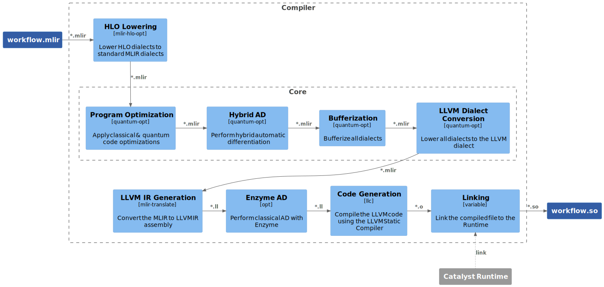

Architecture
============

.. |br| raw:: html

    

Overview
^^^^^^^^

The following diagram represents the current architecture of Catalyst using an
adaption of the C4 container model. The :ref:`Legend` section describes
the notation in more details.

|br|

.. image:: ../_static/arch/overview.svg
  :width: 700
  :alt: Catalyst Overview
  :align: center

|br|

Frontend
^^^^^^^^

To understand the relationships between ``Frontend`` and the compilation
pipeline, we present the following diagram.

|br|

.. image:: ../_static/arch/frontend.svg
  :width: 700
  :alt: Catalyst Frontend
  :align: center

|br|

Compiler Workflow
^^^^^^^^^^^^^^^^^

To understand the workflow and tools being used in the Compiler class, we
present the following diagram. Please note that individual passes are selected
at runtime and may be configured by the user, but this is the default pipeline.

|br|

|br|

.. _Legend:

Legend
^^^^^^

In our `C4 <https://c4model.com/>`_ adaptation, light blue boxes represent
algorithms where in brackets we specify the related technologies in use. Dark
blue boxes specify the data and the grey boxes refer to external projects. Data
flow directions are shown as solid arrows. All other types of relationships
between objects including user actions are shown as dotted arrows.

|br|

.. image:: ../_static/arch/legend.svg
  :width: 250
  :alt: Legend
  :align: center

|br|

