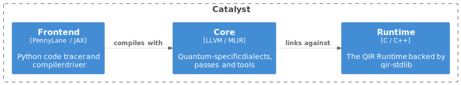
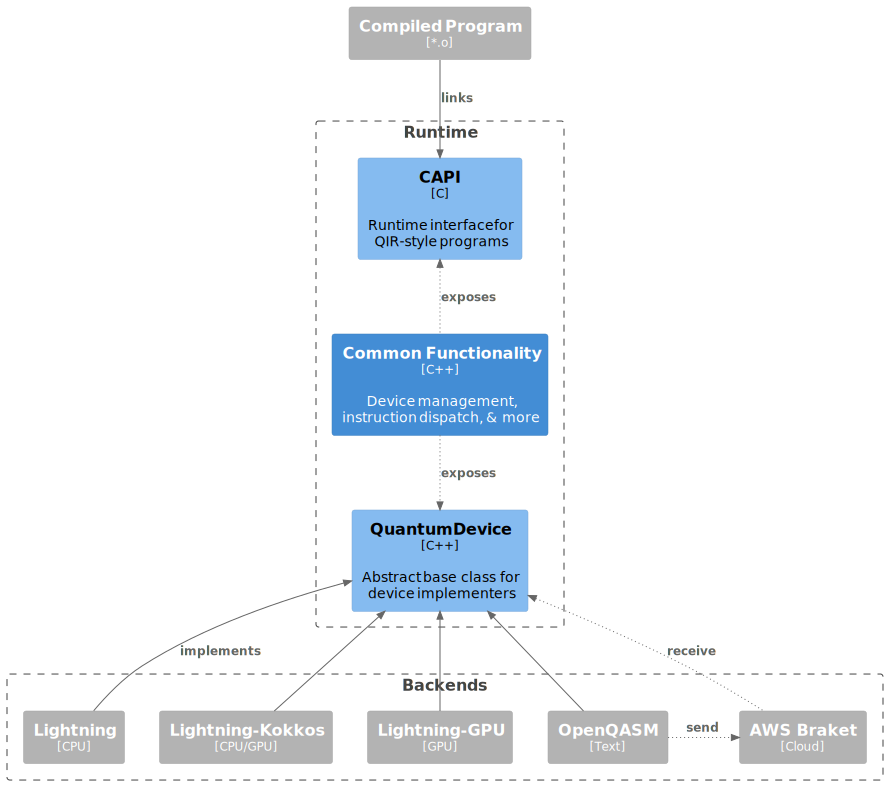

Architecture
============

.. |br| raw:: html

    

The Catalyst stack leverages state-of-the-art technologies to accelerate hybrid quantum-classical
workflows without losing the ability to quickly prototype in Python. To do so, Catalyst builds upon
the `MLIR <https://mlir.llvm.org/docs/>`_ and `LLVM <https://llvm.org/>`_ compiler frameworks,
the `QIR <https://github.com/qir-alliance>`_ project, and the
`JAX <https://jax.readthedocs.io/en/latest/>`_ framework for composable transforms in machine
learning (ML).
Among the transforms provided by JAX, some of the most impactful arguably consist of automatic
differentiation (AD) and just-in-time (JIT) compilation. AD has long been one of the cornerstones of
PennyLane, and, with the introduction of Catalyst, JIT compilation for (hybrid) quantum programs is
added as another.

One of the core goals of Catalyst is to provide a unified representation for hybrid programs with
which to drive optimization, device compilation, automatic differentiation, and many other types of
transformations in a scalable way. Moreover, Catalyst is being developed to support next-generation
quantum programming paradigms, such as dynamic circuit generation with classical control flow,
real-time measurement feedback, qubit reuse, and dynamic quantum memory management. Most
importantly, Catalyst provides a way transform large scale user workflows from Python into low-level
binary code for accelerated execution in heterogenous environments.

While PennyLane is used as the primary frontend to Catalyst, each element of the compilation stack
is in-principle built in a modular and reusable way. Let's take a look at what this stack looks
like.

Compilation Stack
^^^^^^^^^^^^^^^^^

The following diagram represents the current architecture of Catalyst using an adaptation of the
`C4 <https://c4model.com/>`_ container model. The :ref:`legend` section describes the notation in
more detail.

|br|

|br|

The three components of the stack can be summarized as follows:

- **Frontend:** A Python frontend for just-in-time compilation & execution of PennyLane programs.
  Currently traces hybrid computation by leveraging the JAX infrastructure and extending the JAX
  Program Representation, but this will be generalized in the future.

- **Compiler Core:** An MLIR-based compiler for hybrid quantum programs.
  Provides optimizations and other transformations such as automatic differentiation, with a
  growing library of compilation passes.
  Targets LLVM IR with QIR syntax for code generation.

- **Runtime:** A runtime library for execution of hybrid quantum programs.
  While classical computation is compiled to native code, all quantum functionality is managed and
  provided by the runtime as an interface layer to backend devices (such as CPU simulators, GPU
  simulators, and hardware).

Frontend
^^^^^^^^

An overview of the Python frontend is presented below. At the moment, the frontend is not only
responsible for converting user programs to the compiler IR, but also comes with a compiler driver
that manages the entire compilation pipeline.

|br|

|br|

Compilation happens in 3 stages which are successively invoked by the frontend and compiler driver:

- **Program Capture / IR Generation:** The frontend primarily provides a method for hybrid program
  capture of PennyLane/JAX programs. This uses the tracing & op queueing mechanism of both
  frameworks, extending the JAX program representation
  (`JAXPR <https://jax.readthedocs.io/en/latest/jaxpr.html>`_) with quantum
  `primitives <https://jax.readthedocs.io/en/latest/notebooks/How_JAX_primitives_work.html>`_.
  Custom JAXPR → MLIR lowerings are registered to these primitives to fully convert a hybrid
  program to MLIR for consumption by the compiler.

- **Program Transformation:** The main part of compilation is performed on the MLIR-based
  representation for hybrid quantum programs defined by Catalyst. The user program is passed to
  the Catalyst compiler libraries in its textual form, as the MLIR memory objects are not
  compatible between Catalyst and ``jaxlib``. The driver then invokes a sequence of transformations
  that *lowers* the user program to a lower level of abstraction, outputting LLVM IR with QIR
  syntax.
  For more details consult the :ref:`compiler section<compiler>`.

- **Code Generation:** At this stage the LLVM IR is compiled down to native object code using the
  LLVM Static Compiler (``llc``) for the local system architecture. A native linker is then used
  to link the user program to the Catalyst Runtime library. The frontend will load this library
  into the Python environment and attach its entry point to the callable ``@qjit`` object defined
  by the user.
  For more details on the program execution consult the :ref:`runtime section<runtime>`.

Elaborating on the program capture phase, tracing is a mechanism by which a function is executed
with abstract arguments called *tracers*. Calling operations from the tracing library (such as
``jax.numpy``) will record the operation and which tracers (or constants) it acts upon in a global
data structure. Note that JAX's tracing contexts can be nested to allow scoped region capture,
which is relevant when tracing control flow operations.

During the tracing of quantum functions (``qml.qnode``), PennyLane's queuing context is activated to
build a ``QuantumTape`` data structure that records all quantum operations. Nested queuing contexts
are leveraged to allow for scoped operation capture, including control flow operations which are
themselves captured as pseudo-quantum operations on the tape.

Catalyst provides the "glue" to embed quantum tapes into the JAXPR, by converting PennyLane
operations to their corresponding JAX primitive and by connecting operation arguments/results to
the correct tracer objects.

.. seealso:: For more details on the frontend code organization see :doc:`/modules/frontend`.

.. _compiler:

Compiler Core
^^^^^^^^^^^^^

This section will focus on the series of compiler passes that convert a high-level quantum program
to its low-level LLVM IR and subsequent binary form. While the exact passes may frequently change,
the general stages should still be applicable.
See the graph below for an overview of the transformations applied to the user program:

|br|

.. image:: ../_static/arch/compiler.svg
  :width: 800
  :alt: Compiler Core
  :align: center

|br|

- **HLO lowering:**

  - HLO is a high-level IR used by the XLA compiler to compile tensor compute graphs, like those
    produced by JAX and TensorFlow. JAX natively outputs HLO in MLIR form, via the ``StableHLO``
    MLIR dialect.

  - Since we provide our own compilation & code generation pipeline, we lower out of the HLO dialect
    into standard MLIR dialects, such as ``linalg``, ``arith``, ``func``, and others, such that the
    program no longer contains any HLO operations. The term lowering here refers to converting one
    program representation into another "lower down" in the compilation pipeline. This is done using
    the transformation rules (or lowerings) provided by the
    `mlir-hlo <https://github.com/tensorflow/mlir-hlo>`_ project.

  - Quantum dialect operations present in the input are not affected by this transformation.

- **Quantum optimizations:**

  - Many quantum compilation routines can be run at this point, in order to reduce the gate or qubit
    count of the program. This could include
    `peephole optimizations <https://en.wikipedia.org/wiki/Peephole_optimization>`_ expressed as
    MLIR DAG rewrites (such as adjoint cancellation, operator fusion, gate identities, etc.), or
    more complex synthesis algorithms that act on an entire block of quantum code.

- **Automatic differentiation:**

  - Several automatic differentiation routines are implemented at the compiler level. In general,
    a quantum function will be split out into *classical pre-processing* and *quantum execution*.
    Separate compilation routines are then applied to both components.

  - For the classical pre-processing, the main method of differentiation is forward or reverse mode
    AD via the `Enzyme <https://github.com/EnzymeAD/Enzyme>`_ framework. Enzyme can also drive the
    differentiation of the entire program to allow differentiating through post-processing
    functions. In this case, quantum AD methods are registered as custom gradients in the framework.

  - For the quantum execution, different methods are available depending on the execution device.
    On simulators with support for it, the most efficient differentiation method is the
    *adjoint-jacobian* method, a technique similar to classical backpropagation. By taking
    advantage of the reversibility of quantum computing, a backwards pass can be performed with a
    much lower memory footprint than with backpropagation.

    Hardware compatible methods can directly be applied in the compiler without requiring explicit
    device support. This includes the *parameter-shift* method and *finite-differences*. The
    parameter-shift method has been adapted to work in presence of hybrid program representations
    including control flow, as long as measurement feedback is not used.

  - Checkpointing is employed to eliminate redundant invocations of the pre-processing function, by
    storing intermediate results and control flow information in a forward pass through the
    classical code to allow the quantum program to be reconstructed exactly.

- **Classical optimizations:**

  - Basic optimizations are frequently performed in between other passes in order to improve
    performance and reduce the computational load of subsequent transformations. This includes
    dead code elimination, common sub-expression elimination, and constant propagation, as well
    other simplifications (canonicalizations) registered to the various dialect operations.

  - More advanced optimization techniques might also be added to various parts of the pass pipeline.

- **Bufferization:**

  - `Bufferization <https://mlir.llvm.org/docs/Bufferization/>`_ is a process by which operations
    are transformed from operating on *tensors* to operating on memory, represented by *memrefs*
    (memory references) in MLIR. The key difference between the two is that tensors behave according
    to value semantics, that is they cannot be modified in-place. Instead, operations consume and
    produce new tensor values.

  - In order to bufferize a program, memory has to be allocated and a buffer assigned to each
    tensor, reusing buffers whenever possible to minimize unnecessary data copies, and eventually
    deallocating buffers when they are no longer needed to prevent memory leaks.

  - Bufferization should generally be the last step before converting to the LLVM dialect, as
    optimizations are typically easier to implement in the tensor domain than in the memory domain.

- **LLVM dialect generation:**

  - As an intermediate step in the LLVM IR generation, the LLVM dialect in MLIR provides a simple
    target for other dialects to lower to, and simplifies the conversion between MLIR and LLVM IR
    by providing a one-to-one mapping from MLIR objects to LLVM IR objects.

  - Generally, dialects will make use of the dialect conversion infrastructure to provide lowerings
    to the LLVM dialect. The quantum dialect provides lowering patterns to QIR-style operations, and
    the Catalyst gradient dialect can lower to device-based implementations of quantum AD or to an
    Enzyme-based implementation for AD on classical code.

- **LLVM IR generation:**

  - Conversion from the LLVM dialect in MLIR to LLVM IR is handled by the ``mlir-translate`` tool.

- **Enzyme auto-differentiation:**

  - Functions that have been set-up to be differentiated via Enzyme will be transformed at this
    stage. The separately compiled Enzyme library is loaded into the LLVM ``opt`` tool to perform
    the relevant code transformations.

- **LLVM optimizations:**

  - The ``opt`` tool can also be used to run additional LLVM passes at this point, such as
    optimizations.

  - For quantum bound programs, optimizations at this stage may see little benefit however, and are
    generally better left out to save on compilation time.

- **Native code generation:**

  - The LLVM static compiler (``llc``) is invoked to perform code generation for the local target
    architecture. A single object file is produced for the entire user program.

- **Linking:**

  - Using a linker available on the system, the user program is linked against the Catalyst runtime.
    To simplify the process, a compiler will be used to drive the linking process, such as
    ``clang``, ``gcc``, or ``c99``.

  - The shared library produced by the linking step is the output of the compilation process.

.. seealso:: For more details on the compiler code organization see :doc:`/modules/mlir`.

.. _runtime:

Runtime & Execution
^^^^^^^^^^^^^^^^^^^

.. note::
  Catalyst is constantly evolving and improving, and this is especially true for the runtime
  component and execution model. Consequently, the below information may not reflect the latest
  state of development.

The Catalyst Runtime is designed to enable Catalyst's highly dynamic execution model. As such, it
generally assumes real-time communication between a quantum device and its classical controller or
host, although it also supports more restrictive execution models.
Execution of the user program proceeds on the host's native architecture, while the runtime provides
an abstract communication API for quantum devices that the user program is free to invoke at any
time during its execution.

The high-level components of the Catalyst Runtime are shown below.

|br|

|br|

The runtime essentially acts as a bridge between two public interfaces:

- The **QIR API** provides a list of QIR-style symbols to target during the LLVM generation phase
  in the compiler. This includes symbols for runtime functions such as device instantiation,
  quantum memory management, and error message emission. Additionally, quantum operations to be
  executed on a device are also included in this list. The symbols in the user program are then
  directly linked to the definitions provided by the runtime.
  Below are some examples of functions that might be included in the QIR API, please see the
  documentation for an `up-to-date list <https://docs.pennylane.ai/projects/catalyst/en/latest/api/file_runtime_include_RuntimeCAPI.h.html>`__.

  .. code-block:: c

    void __catalyst__rt__initialize();
    void __catalyst__rt__device(int8_t *, int8_t *);
    QUBIT *__catalyst__rt__qubit_allocate();

    void __catalyst__qis__PauliX(QUBIT *);
    void __catalyst__qis__CRZ(double /*angle*/, QUBIT *, QUBIT *);
    RESULT *__catalyst__qis__Measure(QUBIT *);

    ObsIdType __catalyst__qis__NamedObs(int64_t /*name_id*/, QUBIT *);
    double __catalyst__qis__Expval(ObsIdType);
    void __catalyst__qis__Probs(MemRefT_double_1d *, int64_t, /*qubits*/...);

    void __catalyst__qis__Gradient(int64_t, /*results*/...);

- The **QuantumDevice** interface is a C++ abstract base class that devices can implement in
  order to automatically receive dispatched QIR calls whenever the respective quantum device is
  active. This interface is a bit higher level than the QIR API by abstracting away certain
  details, as well as reusing common functionality across devices.
  Below are some examples of functions that might be included in this interface, please see the
  documentation for an `up-to-date list <https://docs.pennylane.ai/projects/catalyst/en/latest/api/file_runtime_include_QuantumDevice.hpp.html>`__.

  .. code-block:: c++

    virtual auto AllocateQubits(size_t num_qubits) -> std::vector<QubitIdType> = 0;

    virtual void NamedOperation(const std::string &name,
                                const std::vector<double> &params,
                                const std::vector<QubitIdType> &wires,
                                bool inverse) = 0;
    virtual auto Measure(QubitIdType wire) -> Result = 0;

    virtual void Probs(DataView<double, 1> &probs) = 0;

    virtual void Gradient(std::vector<DataView<double, 1>> &gradients,
                          const std::vector<size_t> &trainParams) = 0;

Besides the interfaces described above, the runtime also provides a series of other functions
relevant to hybrid program execution:

- **Quantum device management:** The runtime can manage the lifecycle of device instances, which
  are typically instantiated upon request by the program. With multiple backend devices being
  available, the program can request to switch between devices . Quantum instructions are always
  automatically dispatched to the currently active device.

- **Logical qubit management:** Device backends for free to provide "hardware" or device IDs for
  qubits when responding to an allocation request. The runtime keeps a record of active device IDs
  and how they map to logical program qubits. In this way, the same device qubit may be reused for
  different logical qubits, all the while providing some safety guarantees that an operation
  acting on a previously deallocated qubit is not silently rerouted to a device qubit that has
  already been remapped to another logical qubit. Instead, an error is raised as this always
  indicates a bug in the compiled program (use-after-free).

- **Remote execution:** While the aim of Catalyst is to locate the runtime as close to devices as
  possible to enable real-time communication, it currently features a "legacy" execution mode for
  local or remote devices that require a complete quantum circuit ahead of time.
  This mode is enabled via a two-step process:

  - **Assembly generation:** Generators for assembly formats such as
    `OpenQASM <https://openqasm.com/>`_ can be implemented as pseudo execution devices which
    simply print the instructions rather than executing them. One benefit of generating the
    circuit at runtime is that the hybrid program can include arbitrary complex classical code,
    without being constrained by what may or may not be available in the (primarily) quantum
    assembly.

  - **Circuit execution:** Upon completion of the quantum function the generated assembly can
    be sent off to local or remote services for execution. Typically, this involves a much
    higher latency than when executing programs via the runtime directly. As an example,
    Catalyst currently connects to the AWS Braket cloud service for remote execution on NISQ
    hardware, but the full list of supported backends should always be obtained from the
    documentation.

  Circuit execution calls are made in a blocking fashion and will wait until all results are
  returned from the device. This mode also limits the interaction that host code can have with
  device code, such as real-time measurement feedback.

- **Classical memory management:** In order to simplify the bufferization phase in the compiler,
  memory allocations that are returned from functions are allowed to remain live until the end of
  the program. The runtime tracks all allocation requests made by the program and will
  automatically deallocate all remaining buffers by the end of the program's execution.

.. seealso:: For more details on the runtime code organization see :doc:`/modules/runtime`.

.. _legend:

Legend
^^^^^^

In our `C4 <https://c4model.com/>`_ adaptation, light blue boxes represent algorithms where in
brackets we specify the related technologies in use. Dark blue boxes specify the data and the grey
boxes refer to external projects. Data flow directions are shown as solid arrows. All other types
of relationships between objects including user actions are shown as dotted arrows.

|br|

.. image:: ../_static/arch/legend.svg
  :width: 300
  :alt: Legend
  :align: center

|br|
