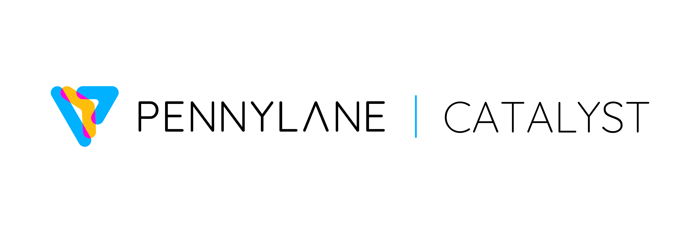

:og:description: Catalyst is a package that enables just-in-time (JIT) compilation of PennyLane programs. Compile the entire quantum-classical workflow.

Catalyst
########

:Release: |release|

.. raw:: html

    

    

        

            Catalyst is a package that enables just-in-time (JIT)
            compilation of PennyLane programs. Compile the entire quantum-classical workflow.
        

      

.. index-card::
    :name: Installation
    :link: dev/installation.html
    :description: Learn how to install Catalyst

.. index-card::
    :name: Quickstart
    :link: dev/quick_start.html
    :description: Get started using Catalyst with PennyLane

.. index-card::
    :name: GitHub
    :link: https://github.com/PennyLaneAI/catalyst
    :description: View the Catalyst source code on GitHub

.. raw:: html

      

   

    

.. mdinclude:: ../README.md
  :start-line: 20
  :end-line: 72

.. mdinclude:: ../README.md
  :start-line: 134
  :end-line: 167

.. toctree::
   :maxdepth: 2
   :hidden:

   dev/installation
   dev/quick_start
   dev/devices
   dev/autograph
   dev/sharp_bits
   dev/jax_integration
   dev/callbacks
   dev/release_notes

.. toctree::
   :maxdepth: 2
   :caption: Development
   :hidden:

   dev/architecture
   PennyLane Frontend <modules/frontend>
   Compiler Core <modules/mlir>
   MLIR Dialects <dev/dialects>
   Compiler Passes <dev/transforms>
   Compiler Plugins <dev/plugins>
   Quantum Runtime <modules/runtime>
   dev/debugging
   dev/custom_devices
   dev/roadmap

.. toctree::
   :maxdepth: 2
   :caption: Examples
   :hidden:

    Magic State Distillation <https://pennylane.ai/qml/demos/tutorial_magic_state_distillation>
    Variational Quantum Eigensolver <https://pennylane.ai/qml/demos/tutorial_how_to_quantum_just_in_time_compile_vqe_catalyst>
    QML Optimization with Optax <https://pennylane.ai/qml/demos/tutorial_How_to_optimize_QML_model_using_JAX_catalyst_and_Optax>
    Shor's Algorithm <https://pennylane.ai/qml/demos/tutorial_shors_algorithm_catalyst>
    Catalyst and Lightning GPU <https://pennylane.ai/qml/demos/how_to_catalyst_lightning_gpu>
    Grover's Algorithm <https://pennylane.ai/qml/demos/tutorial_qjit_compile_grovers_algorithm_with_catalyst>
    

.. toctree::
   :maxdepth: 1
   :caption: API
   :hidden:

   code/__init__
   catalyst-cli/catalyst-cli.rst
   Runtime Device Interface <api/structCatalyst_1_1Runtime_1_1QuantumDevice>
   code/dialects/__init__
