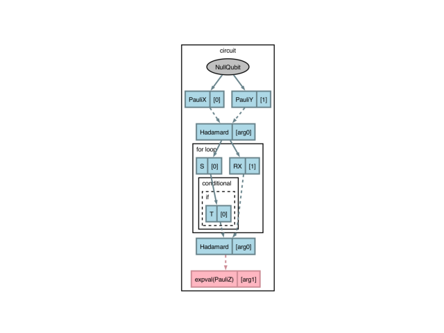
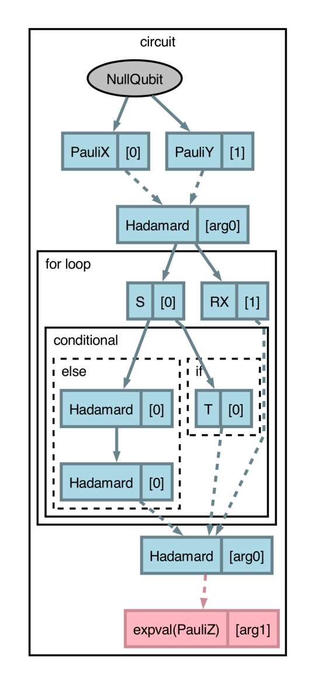

# Release 0.14.0 (development release)

<h3>New features since last release</h3>

* Programs compiled with ``qjit`` can now be visualized with :func:`~.draw_graph`, allowing for 
  sequentially analyzing impacts of compilation passes on structured and dynamic programs.
  [(#2213)](https://github.com/PennyLaneAI/catalyst/pull/2213)
  [(#2229)](https://github.com/PennyLaneAI/catalyst/pull/2229)
  [(#2214)](https://github.com/PennyLaneAI/catalyst/pull/2214)
  [(#2246)](https://github.com/PennyLaneAI/catalyst/pull/2246)
  [(#2231)](https://github.com/PennyLaneAI/catalyst/pull/2231)
  [(#2285)](https://github.com/PennyLaneAI/catalyst/pull/2285)
  [(#2234)](https://github.com/PennyLaneAI/catalyst/pull/2234)
  [(#2218)](https://github.com/PennyLaneAI/catalyst/pull/2218)
  [(#2260)](https://github.com/PennyLaneAI/catalyst/pull/2260)
  [(#2287)](https://github.com/PennyLaneAI/catalyst/pull/2287)
  [(#2243)](https://github.com/PennyLaneAI/catalyst/pull/2243)

  Consider the following circuit:

  ```python
  import pennylane as qml
  import catalyst

  qml.capture.enable()

  @qml.qjit(autograph=True)
  @qml.transforms.cancel_inverses
  @qml.transforms.merge_rotations
  @qml.qnode(qml.device("null.qubit", wires=3))
  def circuit(x, y):
      qml.X(0)
      qml.Y(1)
      qml.H(x) 
      
      for i in range(3):
          qml.S(0)
          qml.RX(0.1, wires=1)
          qml.RX(0.2, wires=1)

          if i == 3:
              qml.T(0)
          else:
              qml.H(0)
              qml.H(0)

      qml.H(x)

      return qml.expval(qml.Z(y))
  ```

  The circuit structure (``for`` loop and conditional branches) along with the dynamicism can be 
  succinctly represented with :func:`~.draw_graph`.

  ```pycon
  >>> print(catalyst.draw_graph(circuit)())
  (<Figure size 640x480 with 1 Axes>, <Axes: >)
  ```
  

  By default, all compilation passes specified will be applied and visualized. However, 
  :func:`~.draw_graph` can be used with the ``level`` argument to inspect compilation pass impacts, 
  where the ``level`` value denotes the cumulative set of applied compilation transforms (in the 
  order they appear) to be applied and visualized. With ``level=1``, drawing the above circuit will 
  apply the ``merge_rotation`` transform only:

  ```pycon
  >>> print(catalyst.draw_graph(circuit, level=1)())
  (<Figure size 640x480 with 1 Axes>, <Axes: >)
  ```
  

  The :func:`~.draw_graph` function visualizes QNodes in a similar manner as
  `view-op-graph in traditional MLIR <https://mlir.llvm.org/docs/Passes/#-view-op-graph>`_,
  which leverages `Graphviz <https://graphviz.org/download/>`_ to show data-flow in compiled
  programs. As such, use of :func:`~.draw_graph` requires installation of 
  `Graphviz <https://graphviz.org/download/>`_ and the
  `pydot <https://pypi.org/project/pydot/>`_ software package. Please consult the links provided for 
  installation instructions. Additionally, it is recommended to use :func:`~.draw_graph` with 
  PennyLane's program capture enabled (see :func:`qml.capture.enable <pennylane.capture.enable>`).

  [(#2298)](https://github.com/PennyLaneAI/catalyst/pull/2298)
  [(#2290)](https://github.com/PennyLaneAI/catalyst/pull/2290)
  [(#2309)](https://github.com/PennyLaneAI/catalyst/pull/2309)
  
* A new `gridsynth` pass is added to support Clifford+T decomopsition. This pass discretizes `RZ` and `PhaseShift` gates to either the Clifford+T basis or to the PPR basis. The pass also supports decomposing single-qubit arbitrary angle PPR in the Z basis.
  [(#2140)](https://github.com/PennyLaneAI/catalyst/pull/2140)
  [(#2166)](https://github.com/PennyLaneAI/catalyst/pull/2166)
  [(#2292)](https://github.com/PennyLaneAI/catalyst/pull/2292)

* Catalyst now features a unified compilation framework, which enables users and developers to design
  and implement compilation passes in Python in addition to C++, on the same Catalyst IR. The Python
  interface relies on the xDSL library to represent and manipulate programs (analogous to the MLIR library
  in C++). As a result, transformations can be quickly prototyped, easily debugged, and dynamically integrated
  into Catalyst without changes to the compiled Catalyst package. The new module is available under the
  `catalyst.python_interface` namespace.
  [(#2199)](https://github.com/PennyLaneAI/catalyst/pull/2199)

  * Fix a bug in the `catalyst.python_interface.pass_api.TranformInterpreterPass` pass that prevented
    pass options from being used correctly.
    [(#2289)](https://github.com/PennyLaneAI/catalyst/pull/2289)

  * Add the `PauliRotOp` operation to the xDSL Quantum dialect.
    [(#2307)](https://github.com/PennyLaneAI/catalyst/pull/2307)

  * Add the `PPRotationArbitraryOp` to the xDSL QEC dialect.
    [(#2307)](https://github.com/PennyLaneAI/catalyst/pull/2307)

  * An xDSL `Universe` containing all custom xDSL dialects and passes has been registered as an entry point,
    allowing usage of PennyLane's dialects and passes with xDSL's command-line tools.
    [(#2208)](https://github.com/PennyLaneAI/catalyst/pull/2208)

  * A new `catalyst.python_interface.inspection.mlir_specs` function has been added to facilitate
    PennyLane's new pass-by-pass specs feature. This function returns information gathered by parsing
    the xDSL generated by a given QJIT object, such as gate counts, measurements, or qubit allocations.
    [(#2238)](https://github.com/PennyLaneAI/catalyst/pull/2238)
    [(#2315)](https://github.com/PennyLaneAI/catalyst/pull/2315)

  This functionality was originally developed as part of the PennyLane package, and has been migrated here.
  For earlier development notes to the feature, please refer to the
  [PennyLane release notes](https://docs.pennylane.ai/en/stable/development/release_notes.html#release-0-43-0).
  In addition, the following changes have been made since the last release:

  * Add an experimental `outline_state_evolution_pass` xDSL pass to `catalyst.python_interface.transforms`,
    which moves all quantum gate operations to a private callable.
    [(#8367)](https://github.com/PennyLaneAI/pennylane/pull/8367)

  * A new experimental `split_non_commuting_pass` compiler pass has been added to
    `catalyst.python_interface.transforms`. This pass splits quantum functions that
    measure observables on the same wires into multiple function executions, where
    each execution measures observables on different wires (using the "wires" grouping
    strategy). The original function is replaced with calls to these generated functions,
    and the results are combined appropriately.
    [(#8531)](https://github.com/PennyLaneAI/pennylane/pull/8531)

  * Add the `PCPhaseOp` operation to the xDSL Quantum dialect.
    [(#8621)](https://github.com/PennyLaneAI/pennylane/pull/8621)

  * Users can now apply xDSL passes without the need to pass the `pass_plugins` argument to
    the `qjit` decorator.
    [(#8572)](https://github.com/PennyLaneAI/pennylane/pull/8572)
    [(#8573)](https://github.com/PennyLaneAI/pennylane/pull/8573)
    [(#2169)](https://github.com/PennyLaneAI/catalyst/pull/2169)
    [(#2183)](https://github.com/PennyLaneAI/catalyst/pull/2183)

  * The :meth:`catalyst.python_interface.transforms.convert_to_mbqc_formalism_pass` now
    supports :class:`~xdsl.dialects.scf.IndexSwitchOp` in IR and ignores regions that have no body.
    [(#8632)](https://github.com/PennyLaneAI/pennylane/pull/8632)

  * The `convert_to_mbqc_formalism` compilation pass now outlines the operations to represent a gate
    in the MBQC formalism into subroutines in order to reduce the IR size for large programs.
    [(#8619)](https://github.com/PennyLaneAI/pennylane/pull/8619)

  * The :meth:`catalyst.python_interface.Compiler.run` method now accepts a string as input,
    which is parsed and transformed with xDSL.
    [(#8587)](https://github.com/PennyLaneAI/pennylane/pull/8587)

  * An `is_xdsl_pass` function has been added to the `catalyst.python_interface.pass_api` module.
    This function checks if a pass name corresponds to an xDSL implemented pass.
    [(#8572)](https://github.com/PennyLaneAI/pennylane/pull/8572)

  * A new `catalyst.python_interface.utils` submodule has been added, containing general-purpose utilities for
    working with xDSL. This includes a function that extracts the concrete value of scalar, constant SSA values.
    [(#8514)](https://github.com/PennyLaneAI/pennylane/pull/8514)

  * The `catalyst.python_interface.visualization` module has been renamed to
    `catalyst.python_interface.inspection`, and various utility functions within this module
    have been streamlined.
    [(#2237)](https://github.com/PennyLaneAI/catalyst/pull/2237)

  * The experimental xDSL :func:`~catalyst.python_interface.transforms.measurements_from_samples_pass`
    pass has been updated to support `shots` defined by an `arith.constant` operation.
    [(#8460)](https://github.com/PennyLaneAI/pennylane/pull/8460)

  * The experimental xDSL :func:`~catalyst.python_interface.transforms.diagonalize_measurements`
    pass has been updated to fix a bug that included the wrong SSA value for final qubit insertion
    and deallocation at the end of the circuit. A clear error is now also raised when there are
    observables with overlapping wires.
    [(#8383)](https://github.com/PennyLaneAI/pennylane/pull/8383)

  * Fixes a bug in the constructor of the xDSL Quantum dialect's `QubitUnitaryOp` that
    prevented an instance from being constructed.
    [(#8456)](https://github.com/PennyLaneAI/pennylane/pull/8456)

  * Removed the `catalyst.python_interface.dialects.transform` module in favor of
    using the `xdsl.dialects.transform` module directly.
    [(#2261)](https://github.com/PennyLaneAI/catalyst/pull/2261)

  * Added a "Unified Compiler Cookbook" RST file, along with tutorials, to `catalyst.python_interface.doc`,
    which provides a quickstart guide for getting started with xDSL and its integration with PennyLane and
    Catalyst.
    [(#8571)](https://github.com/PennyLaneAI/pennylane/pull/8571)

  * xDSL passes are now automatically detected when using the `qjit` decorator.
    This removes the need to pass the `pass_plugins` argument to the `qjit` decorator.
    [(#2169)](https://github.com/PennyLaneAI/catalyst/pull/2169)
    [(#2183)](https://github.com/PennyLaneAI/catalyst/pull/2183)

  * The ``mlir_opt`` property now correctly handles xDSL passes by automatically
    detecting when the Python compiler is being used and routing through it appropriately.
    [(#2190)](https://github.com/PennyLaneAI/catalyst/pull/2190)

  * A new experimental `parity_synth_pass` compiler pass has been added to
    `catalyst.python_interface.transforms`. This pass groups ``CNOT`` and ``RZ`` operators
    into phase polynomials and re-synthesizes them into ``CNOT`` and ``RZ`` operators again.
    [(#2294)](https://github.com/PennyLaneAI/catalyst/pull/2294)

  * The `catalyst.python_interface.pass_api.PassDispatcher` now has a more lightweight implementation.
    [(#2324)](https://github.com/PennyLaneAI/catalyst/pull/2324)

  * The global xDSL pass registry is now explicitly refreshed before compiling workflows decorated with
    :func:`catalyst.qjit`.
    [(#2322)](https://github.com/PennyLaneAI/catalyst/pull/2322)

* Added ``catalyst.switch``, a qjit compatible, index-switch style control flow decorator.
  [(#2171)](https://github.com/PennyLaneAI/catalyst/pull/2171)

* Catalyst can now compile circuits that are directly expressed in terms of Pauli product rotation
  (PPR) and Pauli product measurement (PPM) operations: :class:`~.PauliRot` and
  :func:`~.pauli_measure`, respectively. This support enables research and development
  spurred from [A Game of Surface Codes (arXiv1808.02892)](https://arxiv.org/pdf/1808.02892).
  [(#2145)](https://github.com/PennyLaneAI/catalyst/pull/2145)
  [(#2233)](https://github.com/PennyLaneAI/catalyst/pull/2233)
  [(#2284)](https://github.com/PennyLaneAI/catalyst/pull/2284)


  :class:`~.PauliRot` and :func:`~.pauli_measure` can be manipulated with Catalyst's existing passes
  for PPR-PPM compilation, which includes :func:`catalyst.passes.to_ppr`,
  :func:`catalyst.passes.commute_ppr`, :func:`catalyst.passes.merge_ppr_ppm`,
  :func:`catalyst.passes.ppr_to_ppm`, :func:`catalyst.passes.reduce_t_depth`, and
  :func:`catalyst.passes.ppm_compilation`. For clear and inspectable results, use ``target="mlir"``
  in the ``qjit`` decorator, ensure that PennyLane's program capture is enabled,
  :func:`pennylane.capture.enable`, and call the Catalyst passes from the PennyLane frontend (e.g.,
  ``qml.transforms.ppr_to_ppm`` instead of from ``catalyst.passes.``).

  ```python
  import pennylane as qml
  from functools import partial
  import jax.numpy as jnp

  qml.capture.enable()

  @qjit(target="mlir")
  @partial(qml.transforms.ppm_compilation, decompose_method="auto-corrected")
  @qml.qnode(qml.device("null.qubit", wires=3))
  def circuit():
      # equivalent to a Hadamard gate
      qml.PauliRot(jnp.pi / 2, pauli_word="Z", wires=0)
      qml.PauliRot(jnp.pi / 2, pauli_word="X", wires=0)
      qml.PauliRot(jnp.pi / 2, pauli_word="Z", wires=0)

      ppm = qml.pauli_measure(pauli_word="XYZ", wires=[0, 1, 2])

      # equivalent to a CNOT gate
      qml.PauliRot(jnp.pi / 2, pauli_word="ZX", wires=[0, 1])
      qml.PauliRot(-jnp.pi / 2, pauli_word="Z", wires=[0])
      qml.PauliRot(-jnp.pi / 2, pauli_word="X", wires=[1])

      # equivalent to a T gate
      qml.PauliRot(jnp.pi / 4, pauli_word="Z", wires=0)

      ppm = qml.pauli_measure(pauli_word="YYZ", wires=[0, 2, 1])

      return
  ```

  ```pycon
  >>> print(qml.specs(circuit, level="all")()['resources'])
  {
    'No transforms': ...,
    'Before MLIR Passes (MLIR-0)': ...,
    'ppm-compilation (MLIR-1)': Resources(
      num_wires=6,
      num_gates=14,
      gate_types=defaultdict(<class 'int'>, {'PPM-w3': 2, 'PPM-w2': 4, 'PPM-w1': 4, 'PPR-pi/2-w1': 4}),
      gate_sizes=defaultdict(<class 'int'>, {3: 2, 2: 4, 1: 8}),
      depth=None,
      shots=Shots(total_shots=None, shot_vector=())
    )
  }
  ```

  * A new :func:`~catalyst.passes.decompose_arbitrary_ppr` pass has been added to the `catalyst.passes` module.
    This will decompose an arbitrary angle PPR into a collection of PPRs, PPMs and
    a single-qubit arbitrary PPR in the Z basis.
    [(#2304)](https://github.com/PennyLaneAI/catalyst/pull/2304)

    ```python
      import pennylane as qml
      from catalyst import qjit, measure
      from catalyst.passes import decompose_arbitrary_ppr, to_ppr

      @qjit(pipelines=[("pipe", ["quantum-compilation-stage"])], target="mlir")
      @decompose_arbitrary_ppr
      @to_ppr
      @qml.qnode(qml.device("null.qubit", wires=3))
      def circuit():
          qml.PauliRot(0.123, pauli_word="XXY", wires=[0, 1, 2])
          return

      print(circuit.mlir_opt)
    ```


<h3>Improvements 🛠</h3>

* Catalyst can now use the new `pass_name` property of pennylane transform objects. Passes can now
  be created using `qml.transform(pass_name=pass_name)` instead of `PassPipelineWrapper`.
  [(#2149](https://github.com/PennyLaneAI/catalyst/pull/2149)

* An error is now raised if a transform is applied inside a QNode when program capture is enabled.
  [(#2256)](https://github.com/PennyLaneAI/catalyst/pull/2256)

* A new ``"changed"`` option has been added to the ``keep_intermediate`` parameter of
  :func:`~.qjit`. This option saves intermediate IR files after each pass,
  but only when the IR is actually modified by the pass.
  [(#2186)](https://github.com/PennyLaneAI/catalyst/pull/2186)

* Intermediate IR files are now organized into subdirectories for each compilation stage
  when using ``keep_intermediate="changed"`` or ``keep_intermediate="pass"``.
  [(#2186)](https://github.com/PennyLaneAI/catalyst/pull/2186)

* Resource tracking now tracks calls to `SetState` and `SetBasisState`, and can report results
  that include `qml.StatePrep` operations.
  [(#2230)](https://github.com/PennyLaneAI/catalyst/pull/2230)

* `qml.PCPhase` can be compiled and executed with capture enabled.
  [(#2226)](https://github.com/PennyLaneAI/catalyst/pull/2226)

* Resource tracking now supports dynamic qubit allocation
  [(#2203)](https://github.com/PennyLaneAI/catalyst/pull/2203)

* Pass instrumentation can be applied to each pass within the `NamedSequenceOp` transform sequence for a qnode.
  [(#1978)](https://github.com/PennyLaneAI/catalyst/pull/1978)

* The new graph-based decomposition framework has Autograph feature parity with PennyLane
  when capture enabled. When compiling with `qml.qjit(autograph=True)`, the decomposition rules
  returned by the graph-based framework are now correctly compiled using Autograph.
  This ensures compatibility and deeper optimization for dynamically generated rules.
  [(#2161)](https://github.com/PennyLaneAI/catalyst/pull/2161)

* The ``decompose-lowering`` MLIR pass now supports ``qml.MultiRZ``
  with an arbitrary number of wires. This decomposition is performed
  at MLIR when both capture and graph-decomposition are enabled.
  [(#2160)](https://github.com/PennyLaneAI/catalyst/pull/2160)

* A new option ``use_nameloc`` has been added to :func:`~.qjit` that embeds variable names
  from Python into the compiler IR, which can make it easier to read when debugging programs.
  [(#2054)](https://github.com/PennyLaneAI/catalyst/pull/2054)

* Passes registered under `qml.transform` can now take in options when used with
  :func:`~.qjit` with program capture enabled.
  [(#2154)](https://github.com/PennyLaneAI/catalyst/pull/2154)

* Pytree inputs can now be used when program capture is enabled.
  [(#2165)](https://github.com/PennyLaneAI/catalyst/pull/2165)

* `qml.grad` and `qml.jacobian` can now be used with `qjit` when program capture is enabled.
  [(#2078)](https://github.com/PennyLaneAI/catalyst/pull/2078)

* Dynamically allocated wires can now be passed into control flow and subroutines.
  [(#2130)](https://github.com/PennyLaneAI/catalyst/pull/2130)
  [(#2268)](https://github.com/PennyLaneAI/catalyst/pull/2268)

* The `--adjoint-lowering` pass can now handle PPR operations.
  [(#2227)](https://github.com/PennyLaneAI/catalyst/pull/2227)

* Catalyst now supports Pauli product rotations with arbitrary or dynamic angles in the
  QEC dialect. This will allow :class:`qml.PauliRot` with arbitrary or dynamic angles,
  angles not known at compile time, to be lowered to the QEC dialect. This is implemented
  as a new `qec.ppr.arbitrary` operation, which takes a Pauli product and an arbitrary or
  dynamic angle as input. The arbitrary angles are specified as a double in terms of radian.
  [(#2232)](https://github.com/PennyLaneAI/catalyst/pull/2232)
  [(#2233)](https://github.com/PennyLaneAI/catalyst/pull/2233)

  For example:
  ```mlir
  %const = arith.constant 0.124 : f64
  %1:2 = qec.ppr.arbitrary ["X", "Z"](%const) %q1, %q2 : !quantum.bit, !quantum.bit
  %2:2 = qec.ppr.arbitrary ["X", "Z"](%const) %1#0, %1#1 cond(%c0) : !quantum.bit, !quantum.bit
  ```

<h3>Breaking changes 💔</h3>

* The MLIR pipeline ``enforce-runtime-invariants-pipeline`` has been renamed to
  ``quantum-compilation-pipeline`` and the old ``quantum-compilation-pipeline`` has been renamed to
  ``gradient-lowering-pipeline``. Users who referenced these pipeline names directly would need to
  update their code to use the new names.
  [(#2186)](https://github.com/PennyLaneAI/catalyst/pull/2186)

  * The ``pipeline``  and "passes" postfixes in the compilation stage names have been changed to ``stage``.
  [(#2230)](https://github.com/PennyLaneAI/catalyst/pull/2230)

* The plxpr transform `pl_map_wires` has been removed along with its test.
  [(#2220)](https://github.com/PennyLaneAI/catalyst/pull/2220)

* The JAX version used by Catalyst has been updated to 0.7.0.
  [(#2131)](https://github.com/PennyLaneAI/catalyst/pull/2131)

* (Compiler integrators only) The versions of LLVM/Enzyme/stablehlo used by Catalyst have been
  updated. Enzyme now targets `v0.0.203` with the build target `EnzymeStatic-22`, and the nanobind
  requirement for the latest LLVM has been updated to version 2.9.
  [(#2122)](https://github.com/PennyLaneAI/catalyst/pull/2122)
  [(#2174)](https://github.com/PennyLaneAI/catalyst/pull/2174)
  [(#2175)](https://github.com/PennyLaneAI/catalyst/pull/2175)
  [(#2181)](https://github.com/PennyLaneAI/catalyst/pull/2181)

  - The LLVM version has been updated to
  [commit 113f01a](https://github.com/llvm/llvm-project/tree/113f01aa82d055410f22a9d03b3468fa68600589).
  - The stablehlo version has been updated to
  [commit 0a4440a](https://github.com/openxla/stablehlo/commit/0a4440a5c8de45c4f9649bf3eb4913bf3f97da0d).
  - The Enzyme version has been updated to
  [v0.0.203](https://github.com/EnzymeAD/Enzyme/releases/tag/v0.0.203).

* The pass `remove-chained-self-inverse` has been renamed to `cancel-inverses`, to better
  conform with the name of the corresponding transform in PennyLane.
  [(#2201)](https://github.com/PennyLaneAI/catalyst/pull/2201)

<h3>Deprecations 👋</h3>

<h3>Bug fixes 🐛</h3>

* Updated tests and PennyLane dependency pin to follow changes introduced by
  [PennyLaneAI/pennylane#8290](https://github.com/PennyLaneAI/pennylane/pull/8290).
  [(#2286)](https://github.com/PennyLaneAI/catalyst/pull/2286)

* Update `catalyst.python_interface.inspection.xdsl_conversion.get_mlir_module` to
  no longer explicitly use the xDSL pass plugin.
  [(#2303)](https://github.com/PennyLaneAI/catalyst/pull/2303)

* Added missing `detensorize-function-boundary` and `symbol-dce` passes to `Pipelines.cpp`.
  [(#2266)](https://github.com/PennyLaneAI/catalyst/pull/2266)

* Fixes an issue where a heap-to-stack allocation conversion pass was causing SIGSEGV issues
  during program execution at runtime.
  [(#2172)](https://github.com/PennyLaneAI/catalyst/pull/2172)

* Fixes the issue with capturing unutilized abstracted adjoint and controlled rules
  by the graph in the new decomposition framework.
  [(#2160)](https://github.com/PennyLaneAI/catalyst/pull/2160)

* Fixes the translation of plxpr control flow for edge cases where the `consts` were being
  reordered.
  [(#2128)](https://github.com/PennyLaneAI/catalyst/pull/2128)
  [(#2133)](https://github.com/PennyLaneAI/catalyst/pull/2133)

* Fixes the translation of `QubitUnitary` and `GlobalPhase` ops
  when they are modified by adjoint or control.
  [(##2158)](https://github.com/PennyLaneAI/catalyst/pull/2158)

* Fixes the translation of a workflow with different transforms applied to different qnodes.
  [(#2167)](https://github.com/PennyLaneAI/catalyst/pull/2167)

* Fix canonicalization of eliminating redundant `quantum.insert` and `quantum.extract` pairs.
  When extracting a qubit immediately after inserting it at the same index, the operations can
  be cancelled out while properly updating remaining uses of the register.
  [(#2162)](https://github.com/PennyLaneAI/catalyst/pull/2162)
  For an example:
  ```mlir
  // Before canonicalization
  %1 = quantum.insert %0[%idx], %qubit1 : !quantum.reg, !quantum.bit
  %2 = quantum.extract %1[%idx] : !quantum.reg -> !quantum.bit
  ...
  %3 = quantum.insert %1[%i0], %qubit2 : !quantum.reg, !quantum.bit
  %4 = quantum.extract %1[%i1] : !quantum.reg -> !quantum.bit
  // ... use %1
  // ... use %4

  // After canonicalization
  // %2 directly uses %qubit1
  // %3 and %4 updated to use %0 instead of %1
  %3 = quantum.insert %0[%i0], %qubit2 : !quantum.reg, !quantum.bit
  %4 = quantum.extract %0[%i1] : !quantum.reg -> !quantum.bit
  // ... use %qubit1
  // ... use %4
  ```

* Fixes :func:`~.passes.commute_ppr` and :func:`~.passes.merge_ppr_ppm` incorrectly
  moving nullary operations. This also improves the compilation time by reducing
  the sort function, by explicitly passing the operations that need to be sorted.
  [(#2200)](https://github.com/PennyLaneAI/catalyst/pull/2200)

* The pass pipeline is correctly registered to the transform named sequence of the
  one-shot qnode when `one-shot` mcm method is used.
  [(#2198)](https://github.com/PennyLaneAI/catalyst/pull/2198)

* Fixed a bug where `qml.StatePrep` and `qml.BasisState` might be pushed after other
  gates, overwriting their effects.
  [(#2239)](https://github.com/PennyLaneAI/catalyst/pull/2239)

* Fixed a bug where `quantum.num_qubits` operations are not properly removed during classical
  processing of gradient transforms.
  [(#2262)](https://github.com/PennyLaneAI/catalyst/pull/2262)

  This fix enables automatic qubit management to be used with gradients.


* Fixed the :func:`~.passes.commute_ppr` pass incorrectly modifying operands of PPRs that live in
  different blocks.
  [(#2267)](https://github.com/PennyLaneAI/catalyst/pull/2267)

* The `--inline-nested-module` pass no longer renames external function declarations.
  [(#2244)](https://github.com/PennyLaneAI/catalyst/pull/2244)

  This pass inlines the qnode MLIR modules into the global QJIT MLIR module. If a qnode module
  contains function declarations to external APIs, the names of these declarations must
  stay unchanged. This change enables quantum passes to generate calls to external APIs.

* Fixes a bug where Catalyst was incorrectly raising an error about a missing shots parameter
  on devices that support analytical execution.
  [(#2281)](https://github.com/PennyLaneAI/catalyst/pull/2281)

<h3>Internal changes ⚙️</h3>

* `DecompRuleInterpreter` now solves the graph and adds decompositions rules in the `cleanup` method
  instead of during the first call to `interpret_measurement`.
  [(#2312)](https://github.com/PennyLaneAI/catalyst/pull/2312)

* Update references to `TransformProgram` with `CompilePipeline`
  [(#2314)](https://github.com/PennyLaneAI/catalyst/pull/2314)

* xDSL and xDSL-JAX are now dependencies of Catalyst.
  [(#2282)](https://github.com/PennyLaneAI/catalyst/pull/2282)

* Python 3.14 is now officially supported. Added the forward capability with Python 3.14.
  [(#2271)](https://github.com/PennyLaneAI/catalyst/pull/2271)

* RTIO dialect is added to bypass the compilation flow from OpenAPL to ARTIQ’s LLVM IR. It is
  introduced to bridge the gap between ION dialect and ARTIQ’s LLVM IR. The design philosophy
  of RTIO dialect is primarily event-based. Every operation is asynchronous; sync behaviour occurs
  only via `rtio.sync` or `wait operand` in event operation. And we now support the compiling from
  ION dialect to RTIO dilalect.
  [(#2185)](https://github.com/PennyLaneAI/catalyst/pull/2185)
  [(#2204)](https://github.com/PennyLaneAI/catalyst/pull/2204)

* Integration tests for `qml.specs` have been updated to match the new output format introduced
  in PennyLane.
  [(#2255)](https://github.com/PennyLaneAI/catalyst/pull/2255)

* Resource tracking now writes out at device destruction time instead of qubit deallocation
  time. The written resources will be the total amount of resources collected throughout the
  lifetime of the execution. For executions that split work between multiple functions,
  e.g. with the `split-non-commuting` pass, this ensures that resource tracking outputs
  the total resources used for all splits.
  [(#2219)](https://github.com/PennyLaneAI/catalyst/pull/2219)

* Replaces the deprecated `shape_dtype_to_ir_type` function with the `RankedTensorType.get` method.
  [(#2159)](https://github.com/PennyLaneAI/catalyst/pull/2159)

* Updates to PennyLane's use of a single transform primitive with a `transform` kwarg.
  [(#2177)](https://github.com/PennyLaneAI/catalyst/pull/2177)

* The pytest tests are now run with `strict=True` by default.
  [(#2180)](https://github.com/PennyLaneAI/catalyst/pull/2180)

* Refactor Catalyst pass registering so that it's no longer necessary to manually add new
  passes at `registerAllCatalystPasses`.
  [(#1984)](https://github.com/PennyLaneAI/catalyst/pull/1984)

* Split `from_plxpr.py` into two files.
  [(#2142)](https://github.com/PennyLaneAI/catalyst/pull/2142)

* Re-work `DataView` to avoid an axis of size 0 possibly triggering a segfault via an underflow
  error, as discovered in
  [this comment](https://github.com/PennyLaneAI/catalyst/pull/1598#issuecomment-2779178046).
  [(#1621)](https://github.com/PennyLaneAI/catalyst/pull/2164)

* Decouple the ion dialect from the quantum dialect to support the new RTIO compilation flow.
  The ion dialect now uses its own `!ion.qubit` type instead of depending on `!quantum.bit`.
  Conversion between qubits of quantum and ion dialects is handled via unrealized conversion casts.
  [(#2163)](https://github.com/PennyLaneAI/catalyst/pull/2163)

  For an example, quantum qubits are converted to ion qubits as follows:
  ```mlir
  %qreg = quantum.alloc(1) : !quantum.reg
  %q0 = quantum.extract %qreg[0] : !quantum.reg -> !quantum.bit

  // Convert quantum.bit to ion.qubit
  %ion_qubit_0 = builtin.unrealized_conversion_cast %q0 : !quantum.bit to !ion.qubit

  // Use in ion dialect operations
  %pp = ion.parallelprotocol(%ion_qubit_0) : !ion.qubit {
    ^bb0(%arg1: !ion.qubit):
      // ... ion operations ...
  }
  ```

  * Added support for `ppr-to-ppm` as an individual MLIR pass and python binding
  for the qec dialect.
  [(#2189)](https://github.com/PennyLaneAI/catalyst/pull/2189)

  * Added a canonicalization pattern for `qec.ppr` to remove any PPRs consisting only
  of identities.
  [(#2192)](https://github.com/PennyLaneAI/catalyst/pull/2192)

  * Renamed `annotate-function` pass to `annotate-invalid-gradient-functions` and move it to the
  gradient dialect and the `lower-gradients` compilation stage.
  [(#2241)](https://github.com/PennyLaneAI/catalyst/pull/2241)

  * Added support for PPRs and arbitrary angle PPRs to the :func:`~.passes.merge_rotations` pass.
  This pass now merges PPRs with equivalent angles, and cancels PPRs with opposite angles, or
  angles that sum to identity when the angles are known. The pass also supports conditions on PPRs,
  merging when conditions are identical and not merging otherwise.
  [(#2224)](https://github.com/PennyLaneAI/catalyst/pull/2224)	
  [(#2245)](https://github.com/PennyLaneAI/catalyst/pull/2245)
  [(#2254)](https://github.com/PennyLaneAI/catalyst/pull/2254)
  [(#2258)](https://github.com/PennyLaneAI/catalyst/pull/2258)
  [(#2311)](https://github.com/PennyLaneAI/catalyst/pull/2311)

  * Refactor QEC tablegen files to separate QEC operations into a new `QECOp.td` file
  [(#2253](https://github.com/PennyLaneAI/catalyst/pull/2253)

  * Removed the `getRotationKind` and `setRotationKind` methods from
  the QEC interface `QECOpInterface` to simplify the interface.
  [(#2250)](https://github.com/PennyLaneAI/catalyst/pull/2250)

* A new `PauliFrame` dialect has been added. This dialect includes a set of abstractions and
  operations for interacting with an external Pauli frame tracking library.
  [(#2188)](https://github.com/PennyLaneAI/catalyst/pull/2188)

* A new `to-pauli-frame` compilation pass has been added, which applies the Pauli frame tracking
  protocols to a Clifford+T program.
  [(#2269)](https://github.com/PennyLaneAI/catalyst/pull/2269)

<h3>Documentation 📝</h3>

* A new statevector simulator ``lightning.amdgpu`` has been added for optimized performance on AMD GPUs.
  [(#2283)](https://github.com/PennyLaneAI/catalyst/pull/2283)

  The ``lightning.amdgpu`` device is a specific instantiation of the ``lightning.kokkos`` backend, supporting the same features and operations as ``lightning.kokkos``, with pre-compiled wheels for ``lightning.amdgpu`` available on PyPI for easy installation to use on MI300 series AMD GPUs.

  This device can be used within qjit'd workflows exactly as other devices compatible with Catalyst:

  ```python
  @qml.qjit
  @qml.qnode(qml.device('lightning.amdgpu', wires=2))
  def circuit():
    qml.Hadamard(0)
    return qml.state()
  ```

  ```pycon
  >>> circuit()
  [0.70710678+0.j 0.        +0.j 0.70710678+0.j 0.        +0.j]
  ```

  See the [Lightning-AMDGPU documentation](https://docs.pennylane.ai/projects/lightning/en/latest/lightning_amdgpu/device.html) for more details and installation instructions.

* A typo in the code example for :func:`~.passes.ppr_to_ppm` has been corrected.
  [(#2136)](https://github.com/PennyLaneAI/catalyst/pull/2136)

* Fix `catalyst.qjit` and `catalyst.CompileOptions` docs rendering.
  [(#2156)](https://github.com/PennyLaneAI/catalyst/pull/2156)

* Update `MLIR Plugins` documentation stating that plugins require adding passes via
  `--pass-pipeline`.
  [(#2168)](https://github.com/PennyLaneAI/catalyst/pull/2168)

* Typos in docstring for `PPRotationArbitraryOp` and `PPRRotationOp` have been corrected.
  [(#2297)](https://github.com/PennyLaneAI/catalyst/pull/2297)

<h3>Contributors ✍️</h3>

This release contains contributions from (in alphabetical order):

Ali Asadi,
Joey Carter,
Yushao Chen,
Sengthai Heng,
Jeffrey Kam,
Christina Lee,
Joseph Lee,
Mehrdad Malekmohammadi,
River McCubbin,
Lee J. O'Riordan,
Mudit Pandey,
Andrija Paurevic,
Roberto Turrado,
Paul Haochen Wang,
David Wierichs,
Jake Zaia,
Hongsheng Zheng.
